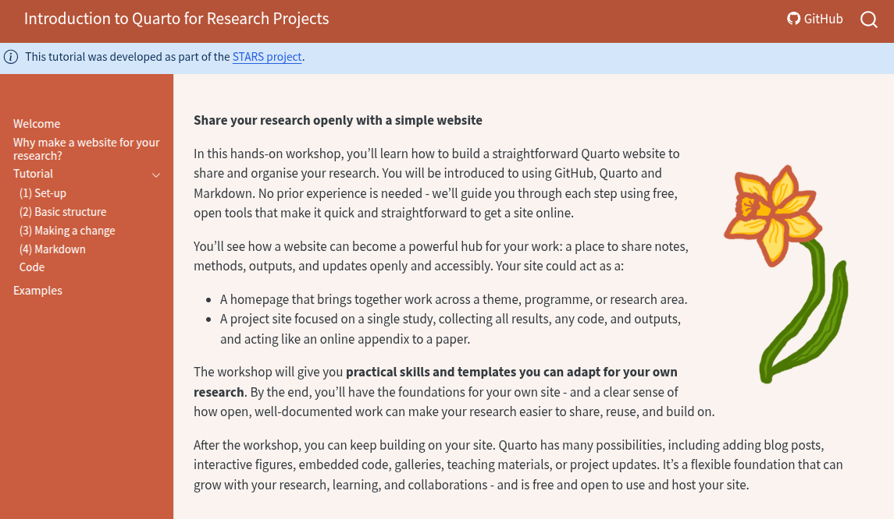

This is a small Quarto website that we will use during the tutorial:

> **Introduction to Quarto for Research Projects**. [Tutorial Website](https://pythonhealthdatascience.github.io/quarto-tutorial/).
>
> 

By the end of the tutorial you will have:

* Opened this template in RStudio on GitHub Codespaces.
* Made a change and rendered the quarto site.
* Made a GitHub commit in a forked version of the repository.
* Used markdown text, callouts, images, videos and other embedded content.
* Modified YAML front matter.
* Customised site appearance using CSS.
* Run code chunks.

To cite this work, please use the following format: TODO.

This course was developed as part of the [STARS project](https://pythonhealthdatascience.github.io/stars/). STARS is supported by the Medical Research Council [grant number MR/Z503915/1].

This work is licensed under a [Creative Commons Attribution 4.0 International (CC BY 4.0)](LICENSE) licence.
